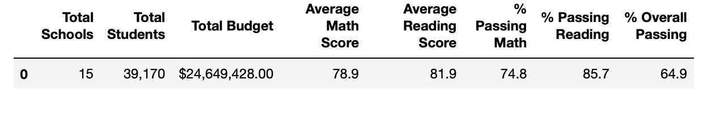
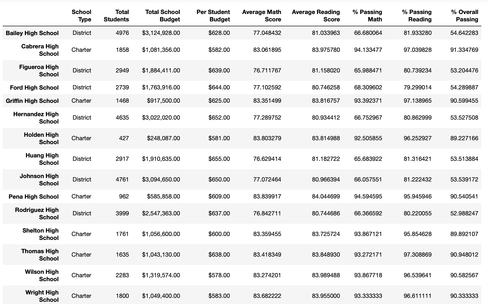

# School_District_Analysis
## Purpose
After completing an analysis on students standardized test scores and funding for all high schools to assist the school board in making decisions for the school district, it was discovered that there had been some academic dishonesty. In order to uphold state-testing standards, the data for Thomas High School's ninth grade students needed to be nullified. The math and reading scores were replaced with Nans and the analysis was then repeated. This report shows how the overall analysis has changed. 
## Results
### How is the district summary affected?
* In the images below we can see that the overall % passing decreased by about .2%. This is only a slight difference. There was not a huge difference in the average scores.
*District summary before*
 
*District Summary after*

### How is the school summary affected?
* In the images below we can see that after the Thomas High School data was adjusted to only reflect grades 10-12, the grades only fluctuated slightly. They changed less than one percentage point. 
*School summary before*

*School summary after*

## How does replacing the ninth graders’ math and reading scores affect Thomas High School’s performance relative to the other schools?
* Replacing the scores did not affect their performance relative to other schools. Thomas High School is still ranked second as their overall passing percentage and averages did not fluctuate all that much. 
## How does replacing the ninth-grade scores afftect the following:
* Math and reading scores by grade: There are no changes in the scores for grades 10-12th for Thomas High School. The ninth-graders scores have been replaced by NaN's. 
* Scores by school spending: There are no major changes in the scores by school spending as we have only changed the data for one grade in one school. (9th grade in Thomas High school) There is some rounding differences but no changes larger than 1%.
* Scores by school size:  The only bin that is affected is the "1000-2000" bine, where Thomas High School sits. However, as we explored earlier the scores change so minimally that when we round we don't find any changes. 
* Score by school type: As Thomas High School is a Charter school those scores changed minimally. Once again, it is a very small change that is not noticeable once figures are rounded. 
Original Analysis of type of school

Analysis for type of school after ninth grade score are voided

## Summary 
* The largest change I saw in the analysis I performed that included Thomas High Schools's ninth graders and the analysis that voided those scores is the number of students. However the decrease was not included in the analysis
* Another change was the NaN values. In the original analysis there were no empty or void values. However, when we performed the analysis again without the scores that were associated with acadeic dishonesty those values were void. 
* The school summary showed that the grades for Thomas High School changed less than 1% percentage point. This change did not change their ranking in the district or any of the original findings. 
* The district summary showed the overall passing percentage with a difference of about .2%. However these values would be the same once those values are rounded. 
